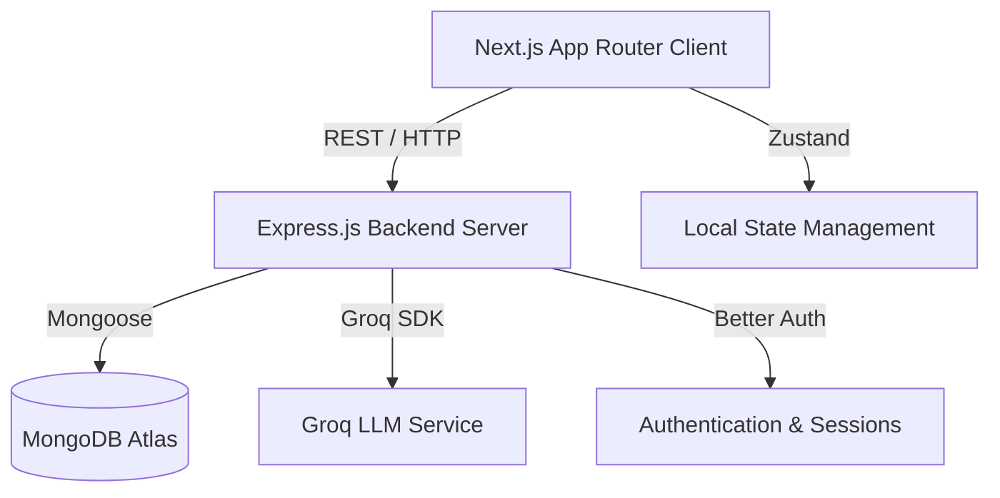

# 02. Architecture

## Purpose
This document provides a high-level overview of the system architecture, layer responsibilities, and request flows.

## When to read
Read this when you need a mental model of how the Next.js client, Express backend, and external APIs interact.

## Related documents
- [03. Folder Structure](./03_Folder_Structure.md)
- [08. Code Flow](./08_Code_Flow.md)

## Table of Contents
- [1. Architecture Philosophy](#1-architecture-philosophy)
- [2. High-Level Overview](#2-high-level-overview)
- [3. Client Architecture (Frontend)](#3-client-architecture-frontend)
- [4. Server Architecture (Backend)](#4-server-architecture-backend)
- [5. Application Flow](#5-application-flow)
- [6. Architectural Decisions](#6-architectural-decisions)

## Main Content

### 1. Architecture Philosophy
IoT Copilot is built on a strict separation of concerns, ensuring modularity, type safety, and scalability. The frontend handles presentation and user interaction, while the backend is responsible for business logic, data persistence, and external API integrations (like Groq AI).

### 2. High-Level Overview


### 3. Client Architecture (Frontend)
- **Framework:** Next.js 14+ (App Router)
- **Language:** TypeScript
- **Styling:** Tailwind CSS with a custom Glassmorphic design system (`globals.css` / `tailwind.config.ts`).
- **State Management:** Zustand (`client/src/store/`) is used for global state, specifically for Authentication (`authStore.ts`), which acts as a bridge to the Better Auth client.
- **Data Fetching:** Native fetch API wrapped in custom utilities (`lib/api/client-api.ts`), combined with React `useEffect` and custom hooks for component-level data binding. Uses `Promise.all` for highly performant, parallel database queries where applicable.
- **Animations:** Framer Motion is heavily utilized for complex SVG animations, route transitions, and interactive UI micro-animations.
- **Smooth Scrolling:** Lenis integration provides global, performant smooth scrolling across all App Router pages.
- **Accessibility & Polish:** Highly polished UI with accessible contrast ratios, screen-reader-friendly semantic HTML, and extensive glassmorphic micro-interactions.

#### Request Flow (Client)
1. **User Interaction:** User clicks a button or navigates to a route.
2. **Next.js Routing:** The App Router resolves the page (e.g., `app/dashboard/page.tsx`).
3. **State Check:** The page typically references `useAuthStore` to verify session validity.
4. **Data Fetching:** The component fires an async function (e.g., `getDashboardStats()`) which utilizes the `clientFetch` wrapper.
5. **Rendering:** Data is passed to modular UI components (e.g., `ProgressChart.tsx`, `SkillRadar.tsx`) utilizing Recharts or custom SVGs.

### 4. Server Architecture (Backend)
- **Framework:** Express.js (Node.js runtime)
- **Language:** TypeScript
- **Database:** MongoDB via Mongoose ODM.
- **Authentication:** Better Auth is configured natively on the server (`server/src/auth.ts`) to handle sessions, password hashing, and user management.
- **AI Integration:** Groq SDK (Groq 2.5 Flash) is integrated via dedicated service files (`server/src/services/ai.ts`).

#### Request Flow (Server)
1. **Ingress:** HTTP request hits the Express application (`server/src/app.ts`).
2. **Middleware:** 
   - `cors`, `helmet`, `express.json` parse and secure the request.
   - For protected routes, Better Auth middleware validates the session token.
3. **Routing:** Request is routed through `server/src/routes/` (e.g., `aiRoutes.ts`, `projectRoutes.ts`).
4. **Controllers:** The route delegates to a controller (e.g., `projectController.ts`), which parses request bodies and queries.
5. **Services/Models:** The controller interacts with Mongoose models (`server/src/models/`) or external services (Groq).
6. **Response:** A standardized JSON response is returned to the client.

### 5. Application Flow
```mermaid
graph TD
    A[Component (e.g., ProjectForm)] -->|Calls helper| B[lib/api/project.ts]
    B -->|Invokes fetcher| C[lib/core/server.ts]
    C -->|HTTP REST| D[Backend Router]
    D -->|Validates/Routes| E[Backend Controller]
    E -->|Business Rules| F[Backend Service]
    F <-->|Mongoose Queries| G[(MongoDB)]
    F <-->|AI Prompting| H[Groq API]
```

### 6. Architectural Decisions
1. **No direct `fetch` in components:** To ensure consistency and centralized error handling, all network requests must go through `lib/api`.
2. **Service Layer in Backend:** Keeps controllers thin and makes business logic testable and reusable.
3. **Zod Validation:** Ensures data integrity at runtime before processing logic.

## Related Source Code
- `client/src/lib/api/*`
- `server/src/controllers/*`
- `server/src/services/*`

## Last Updated
2026-08-02
