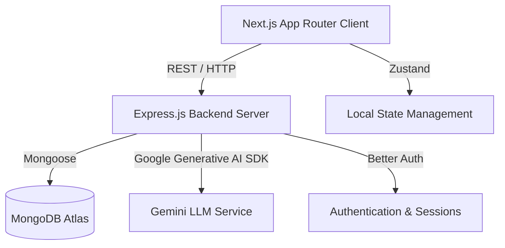

# 02. Project Architecture

IoT Copilot utilizes a decoupled, modern web architecture separating the frontend client from the backend API services.

## 1. High-Level Overview

## 2. Client Architecture (Frontend)
- **Framework:** Next.js 14+ (App Router)
- **Language:** TypeScript
- **Styling:** Tailwind CSS with a custom Glassmorphic design system (`globals.css` / `tailwind.config.ts`).
- **State Management:** Zustand (`client/src/store/`) is used for global state, specifically for Authentication (`authStore.ts`), which acts as a bridge to the Better Auth client.
- **Data Fetching:** Native fetch API wrapped in custom utilities (`lib/api/client-api.ts`), combined with React `useEffect` and custom hooks for component-level data binding.
- **Animations:** Framer Motion is heavily utilized for complex SVG animations, route transitions, and interactive UI micro-animations.

### Request Flow (Client)
1. **User Interaction:** User clicks a button or navigates to a route.
2. **Next.js Routing:** The App Router resolves the page (e.g., `app/dashboard/page.tsx`).
3. **State Check:** The page typically references `useAuthStore` to verify session validity.
4. **Data Fetching:** The component fires an async function (e.g., `getDashboardStats()`) which utilizes the `clientFetch` wrapper.
5. **Rendering:** Data is passed to modular UI components (e.g., `ProgressChart.tsx`, `SkillRadar.tsx`) utilizing Recharts or custom SVGs.

## 3. Server Architecture (Backend)
- **Framework:** Express.js (Node.js runtime)
- **Language:** TypeScript
- **Database:** MongoDB via Mongoose ODM.
- **Authentication:** Better Auth is configured natively on the server (`server/src/auth.ts`) to handle sessions, password hashing, and user management.
- **AI Integration:** Google Generative AI SDK (Gemini 2.5 Flash) is integrated via dedicated service files (`server/src/services/ai.ts`).

### Request Flow (Server)
1. **Ingress:** HTTP request hits the Express application (`server/src/app.ts`).
2. **Middleware:** 
   - `cors`, `helmet`, `express.json` parse and secure the request.
   - For protected routes, Better Auth middleware validates the session token.
3. **Routing:** Request is routed through `server/src/routes/` (e.g., `aiRoutes.ts`, `projectRoutes.ts`).
4. **Controllers:** The route delegates to a controller (e.g., `projectController.ts`), which parses request bodies and queries.
5. **Services/Models:** The controller interacts with Mongoose models (`server/src/models/`) or external services (Gemini).
6. **Response:** A standardized JSON response is returned to the client.

## 4. Folder Relationships
- `client/src/app`: Contains the Next.js routing logic. Pages here compose components from `features/` and `components/`.
- `client/src/features`: Domain-driven directories (e.g., `dashboard`, `projects`, `ai`, `landing`) that encapsulate logic and UI specific to a business domain.
- `client/src/components`: Generic, highly reusable UI elements (e.g., `Button`, `Input`, `Card`, `IoTLoader`).
- `server/src/models`: Defines the data schema (Mongoose).
- `server/src/controllers`: Contains the business logic orchestrating models and responses.
- `server/src/routes`: Maps HTTP endpoints to controllers.

## 5. Data Flow (Example: AI Chat)
1. **Client Input:** User types a message in `ChatInput.tsx`.
2. **Stream Request:** `ai-stream.ts` initiates an HTTP POST to `/api/ai/chat` utilizing the Fetch API for streaming.
3. **Server Processing:** `aiController.ts` receives the message history, formats the prompt, and calls `aiService.chat()`.
4. **Gemini API:** The server streams the prompt to the Google Gemini API.
5. **Server Streaming Response:** As Gemini responds, the Express server pipes the chunks back to the client via Server-Sent Events (SSE) or raw stream.
6. **Client Rendering:** The `ai-stream.ts` utility parses the incoming chunks and updates the React state incrementally, causing the UI to type out the response in real-time.
