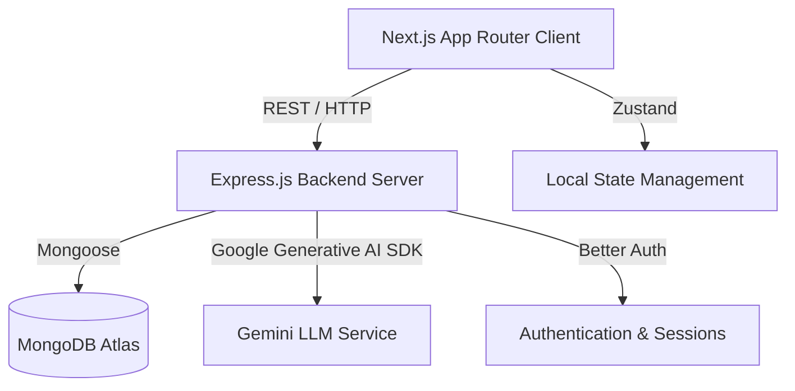

<!-- Content from ARCHITECTURE.md -->

# System Architecture

## Architecture Philosophy
IoT Copilot is built on a strict separation of concerns, ensuring modularity, type safety, and scalability. The frontend handles presentation and user interaction, while the backend is responsible for business logic, data persistence, and external API integrations (like Gemini AI).

## Layer Responsibilities
- **Client Components:** Handle UI rendering, local state, and capturing user input.
- **Client API Lib (`lib/api`):** Typed wrapper functions for all HTTP requests to the backend.
- **Client Core (`lib/core`):** Core networking configuration, specifically the `server.ts` fetch wrapper.
- **Backend Controllers:** Route handlers that extract request data and format HTTP responses.
- **Backend Services:** Execute business logic and interact with the database models.
- **Backend Models:** Define the MongoDB schema and handle direct database operations.

## Application Flow

```mermaid
graph TD
    A[Component (e.g., ProjectForm)] -->|Calls helper| B[lib/api/project.ts]
    B -->|Invokes fetcher| C[lib/core/server.ts]
    C -->|HTTP REST| D[Backend Router]
    D -->|Validates/Routes| E[Backend Controller]
    E -->|Business Rules| F[Backend Service]
    F <-->|Mongoose Queries| G[(MongoDB)]
    F <-->|AI Prompting| H[Gemini API]
```

## Architectural Decisions
1. **No direct `fetch` in components:** To ensure consistency and centralized error handling, all network requests must go through `lib/api`.
2. **Service Layer in Backend:** Keeps controllers thin and makes business logic testable and reusable.
3. **Zod Validation:** Ensures data integrity at runtime before processing logic.

---
### Document Meta
- **Last Updated:** 2026-07-29
- **Related Documents:** [FRONTEND.md](./FRONTEND.md), [BACKEND.md](./BACKEND.md)
- **Revision History:** Initial release (v1.0.0)


<!-- Content from FRONTEND.md -->

# Frontend Documentation

The frontend is a Next.js application using the App Router, located in `client/`.

## Directory Structure & Rules

- **`app/`**: Contains Next.js page routes, layouts, and global CSS.
  - *Rule:* Only route definitions and page assembly should happen here. Complex logic belongs in `features/`.
- **`features/`**: Domain-specific modules (e.g., `ai/`, `projects/`, `dashboard/`).
  - *Rule:* Each feature should contain its own `components/` if they are highly specific to that feature. Features should not deeply import from each other.
- **`components/`**: Global, reusable UI components.
  - **`ui/`**: Generic, headless or highly styled atomic components (e.g., Buttons, Inputs).
  - **`layout/`**: Structural components (e.g., Navbar, Sidebar).
- **`lib/`**: Core networking and utility logic.
  - **`api/`**: Typed helper functions wrapping network calls (e.g., `project.ts`, `ai.ts`).
  - **`actions/`**: Next.js Server Actions (if used).
  - **`core/`**: Core utilities, specifically `server.ts` for customized fetch logic.
- **`utils/`**: General helper functions (e.g., formatting dates, classes).
- **`types/`**: Global TypeScript interfaces (e.g., `api.ts`, `user.ts`).

## Adding New Pages
1. Create a folder in `app/` matching the desired route (e.g., `app/settings/`).
2. Add a `page.tsx` file inside the folder.
3. Import required components from `features/` or `components/`.

## Adding New Features
1. Create a folder under `features/[feature-name]/`.
2. Inside, create subdirectories like `components/`, `hooks/`, `types.ts` if needed.
3. Use the feature components inside `app/` routes.

---
### Document Meta
- **Last Updated:** 2026-07-29
- **Related Documents:** [ARCHITECTURE.md](./ARCHITECTURE.md), [CODING_STANDARDS.md](./CODING_STANDARDS.md)
- **Revision History:** Initial release (v1.0.0)


<!-- Content from BACKEND.md -->

# Backend Documentation

The backend is an Express.js server located in `server/`, structured by technical layers.

## Directory Structure

- **`controllers/`**: Extracts data from HTTP requests (`req.body`, `req.query`), invokes the relevant Service, and formats the HTTP response (`res.json()`).
- **`routes/`**: Connects HTTP methods and paths to Controllers. Attaches middlewares.
- **`middlewares/`**: Request interceptors. Includes `auth` (Better Auth integration), `validate` (Zod schema checking), and `errorHandler`.
- **`services/`**: The core business logic layer. Performs DB operations via Models and interacts with external APIs (like Gemini).
- **`models/`**: Mongoose schemas defining the MongoDB collections.
- **`validators/`**: Zod schemas used by the validation middleware to sanitize incoming data.
- **`config/`**: Setup logic for the application (e.g., MongoDB connection, Better Auth config).
- **`types/`**: TypeScript interfaces and types for the backend scope.
- **`utils/`**: Helper utilities (e.g., `logger.ts`, `ApiResponse.ts`).

## Request Lifecycle
1. **Incoming Request** hits a Route (e.g., `POST /api/projects`).
2. **Middleware:** `auth` checks for a valid session. `validate` ensures the body matches the Zod schema.
3. **Controller:** Receives the validated request and calls `ProjectService.createProject()`.
4. **Service:** Executes logic and uses `ProjectModel` to save to MongoDB.
5. **Controller:** Formats the successful result or catches errors via the global error handler.

## Authentication Lifecycle
1. User submits credentials to `POST /api/auth/login`.
2. Better Auth validates credentials against the `Users` collection.
3. Upon success, Better Auth generates a session and sets an `HttpOnly` cookie.
4. Subsequent requests include the cookie, which the `requireAuth` middleware verifies.

---
### Document Meta
- **Last Updated:** 2026-07-29
- **Related Documents:** [API.md](./API.md), [AUTHENTICATION.md](./AUTHENTICATION.md)
- **Revision History:** Initial release (v1.0.0)


<!-- Content from 02_Project_Architecture.md -->

# 02. Project Architecture

IoT Copilot utilizes a decoupled, modern web architecture separating the frontend client from the backend API services.

## 1. High-Level Overview



## 2. Client Architecture (Frontend)
- **Framework:** Next.js 14+ (App Router)
- **Language:** TypeScript
- **Styling:** Tailwind CSS with a custom Glassmorphic design system (`globals.css` / `tailwind.config.ts`).
- **State Management:** Zustand (`client/src/store/`) is used for global state, specifically for Authentication (`authStore.ts`), which acts as a bridge to the Better Auth client.
- **Data Fetching:** Native fetch API wrapped in custom utilities (`lib/api/client-api.ts`), combined with React `useEffect` and custom hooks for component-level data binding.
- **Animations:** Framer Motion is heavily utilized for complex SVG animations, route transitions, and interactive UI micro-animations.

### Request Flow (Client)
1. **User Interaction:** User clicks a button or navigates to a route.
2. **Next.js Routing:** The App Router resolves the page (e.g., `app/dashboard/page.tsx`).
3. **State Check:** The page typically references `useAuthStore` to verify session validity.
4. **Data Fetching:** The component fires an async function (e.g., `getDashboardStats()`) which utilizes the `clientFetch` wrapper.
5. **Rendering:** Data is passed to modular UI components (e.g., `ProgressChart.tsx`, `SkillRadar.tsx`) utilizing Recharts or custom SVGs.

## 3. Server Architecture (Backend)
- **Framework:** Express.js (Node.js runtime)
- **Language:** TypeScript
- **Database:** MongoDB via Mongoose ODM.
- **Authentication:** Better Auth is configured natively on the server (`server/src/auth.ts`) to handle sessions, password hashing, and user management.
- **AI Integration:** Google Generative AI SDK (Gemini 2.5 Flash) is integrated via dedicated service files (`server/src/services/ai.ts`).

### Request Flow (Server)
1. **Ingress:** HTTP request hits the Express application (`server/src/app.ts`).
2. **Middleware:** 
   - `cors`, `helmet`, `express.json` parse and secure the request.
   - For protected routes, Better Auth middleware validates the session token.
3. **Routing:** Request is routed through `server/src/routes/` (e.g., `aiRoutes.ts`, `projectRoutes.ts`).
4. **Controllers:** The route delegates to a controller (e.g., `projectController.ts`), which parses request bodies and queries.
5. **Services/Models:** The controller interacts with Mongoose models (`server/src/models/`) or external services (Gemini).
6. **Response:** A standardized JSON response is returned to the client.

## 4. Folder Relationships
- `client/src/app`: Contains the Next.js routing logic. Pages here compose components from `features/` and `components/`.
- `client/src/features`: Domain-driven directories (e.g., `dashboard`, `projects`, `ai`, `landing`) that encapsulate logic and UI specific to a business domain.
- `client/src/components`: Generic, highly reusable UI elements (e.g., `Button`, `Input`, `Card`, `IoTLoader`).
- `server/src/models`: Defines the data schema (Mongoose).
- `server/src/controllers`: Contains the business logic orchestrating models and responses.
- `server/src/routes`: Maps HTTP endpoints to controllers.

## 5. Data Flow (Example: AI Chat)
1. **Client Input:** User types a message in `ChatInput.tsx`.
2. **Stream Request:** `ai-stream.ts` initiates an HTTP POST to `/api/ai/chat` utilizing the Fetch API for streaming.
3. **Server Processing:** `aiController.ts` receives the message history, formats the prompt, and calls `aiService.chat()`.
4. **Gemini API:** The server streams the prompt to the Google Gemini API.
5. **Server Streaming Response:** As Gemini responds, the Express server pipes the chunks back to the client via Server-Sent Events (SSE) or raw stream.
6. **Client Rendering:** The `ai-stream.ts` utility parses the incoming chunks and updates the React state incrementally, causing the UI to type out the response in real-time.


<!-- Content from 20_Architecture_Refactor_Report_Part_1.md -->

# Complete Project Documentation Report - Part 1

> [!NOTE]
> This is Part 1 of the comprehensive technical report covering the recent architecture refactor. It serves as the official documentation for new developers joining the `Iot-copilot` project.

## SECTION 1 — Project Overview

### What this project does
Iot-copilot is a comprehensive platform designed to facilitate learning, community interaction, and project building in the IoT (Internet of Things) space. It features AI-powered assistance (copilot), project management, learning paths, and a community hub.

### Main Purpose
To provide developers and enthusiasts with an all-in-one ecosystem for IoT development, including guided learning, collaborative project building, and AI-driven troubleshooting.

### Main Modules
- **Authentication & User Management**: Registration, login, profile management, role-based access control (Admin vs User).
- **Projects**: Creating, managing, and showcasing IoT projects.
- **Learning**: Structured learning paths, progress tracking, and educational content.
- **Community**: Forums, comments, activity feeds, and social interactions.
- **AI Integration**: AI-driven chat, memory storage, and streaming assistance for IoT tasks.
- **Admin Dashboard**: System overview, user management, and platform moderation.

### Overall Architecture
The project follows a decoupled client-server architecture:
- **Frontend (Client)**: Next.js (App Router) application. It handles routing, UI rendering (React), and client-side state. It communicates with the backend via server-side fetches and Server Actions.
- **Backend (Server)**: Node.js/Express REST API. It handles business logic, database operations (MongoDB/Mongoose), and AI integrations (Gemini).

### Technology Stack
- **Frontend**: Next.js (React), TailwindCSS, TypeScript.
- **Backend**: Node.js, Express.js, TypeScript.
- **Database**: MongoDB with Mongoose ODM.
- **Auth**: Better-Auth (cookie-based session management).
- **AI**: Google Gemini API.

### Folder Structure
```text
Iot-copilot/
├── client/                 # Next.js Frontend
│   └── src/
│       ├── app/            # Next.js App Router pages
│       ├── components/     # Reusable React components
│       ├── features/       # Feature-based modular code
│       ├── lib/            # Core library (API, Actions, Core) - REFACTORED
│       ├── store/          # Global state management
│       ├── types/          # TypeScript definitions
│       └── utils/          # Helper functions
└── server/                 # Express Backend
    └── src/
        ├── controllers/    # Request handlers
        ├── models/         # Mongoose schemas
        ├── routes/         # Express routes
        ├── services/       # Business logic
        └── utils/          # Helper functions
```

---

## SECTION 2 — Architecture

### lib/ Architecture Detail

The refactored `lib/` directory in the client acts as the central communication bridge between the Next.js frontend and the Express backend. It is divided into three main layers:

```text
lib/
 ├── core/       # Foundational networking and session logic
 ├── actions/    # Next.js Server Actions (Mutations)
 └── api/        # Server-side Data Fetching (Queries)
```

### Why this architecture was chosen
This architecture clearly separates **data fetching (queries)** from **data mutation (actions)** while sharing a common, robust **core** for HTTP requests and authentication. This aligns perfectly with Next.js App Router paradigms.

### What problem it solves
- **Code Duplication**: Previously, every component manually attached auth headers and handled API base URLs.
- **Security**: Sensitive operations and tokens are kept server-side.
- **Type Safety**: Centralized API and Action layers allow for predictable typing for responses.

### Request Flow (Mutations)
```text
UI (Button Click)
↓
Server Action (lib/actions/*.ts)
↓
Core Mutation (lib/core/server.ts -> serverMutation)
↓
Express Backend (POST/PUT/DELETE)
↓
Database (MongoDB)
```

### Request Flow (GET / Data Fetching)
```text
Server Component (app/page.tsx)
↓
API Fetcher (lib/api/*.ts)
↓
Core Fetch (lib/core/server.ts -> protectedFetch)
↓
Express Backend (GET)
↓
Database (MongoDB)
```

---

## SECTION 3 — Every File Explained

We have created/modified a specific set of files under `client/src/lib/` to implement this architecture. They are broken down in detail in the following sections.

---

## SECTION 4 — API Layer

The API layer (`lib/api/`) contains functions intended to be called from Next.js **Server Components** to fetch data. They use `use server` directives but primarily serve as read-only queries.

### lib/api/user.ts
- **Purpose**: Fetches user-specific data.
- **Functions**:
  - `getProfile(id: string)`: Returns user profile data. Calls `GET /users/:id`. Used in the Profile page.
  - `getBadges(id: string)`: Returns badges earned by the user. Calls `GET /users/:id/badges`.

### lib/api/project.ts
- **Purpose**: Retrieves IoT project data.
- **Functions**:
  - `getProjects(params)`: Returns a list of projects based on query params. Calls `GET /projects`. Used in the Projects Feed.
  - `getProjectById(id: string)`: Returns a single project details. Calls `GET /projects/:id`.

### lib/api/learning.ts
- **Purpose**: Fetches learning paths and modules.
- **Functions**:
  - `getLearningPaths()`: Retrieves all available paths. Calls `GET /learningPath`.
  - `getLearningPathById(id: string)`: Retrieves a specific path. Calls `GET /learningPath/:id`.

### lib/api/community.ts
- **Purpose**: Retrieves forum threads and comments.
- **Functions**:
  - `getPosts()`: Fetches community posts. Calls `GET /community`.
  - `getComments(postId: string)`: Fetches comments for a post. Calls `GET /community/:postId/comments`.

### lib/api/ai.ts & ai-stream.ts
- **Purpose**: Interacts with the AI backend endpoints.
- **Functions**:
  - `getAiHistory(userId: string)`: Retrieves past AI conversations. Calls `GET /ai/history`.
  - `ai-stream.ts`: Specialized file handling Server-Sent Events (SSE) or streaming responses for real-time AI typing effects.

### lib/api/admin.ts & dashboard.ts
- **Purpose**: Fetches analytics and system data for administrators.
- **Functions**:
  - `getSystemStats()`: Retrieves user/project counts. Calls `GET /admin/stats`.
  - `getDashboardData()`: Used by the user dashboard to get an overview of their activities.

### lib/api/client-api.ts
- **Purpose**: A wrapper for API calls that must be executed from **Client Components** (e.g., infinite scrolling, client-side filtering).

---

## SECTION 5 — Actions Layer

The Actions layer (`lib/actions/`) contains Next.js **Server Actions**. These are strictly for mutations (POST, PUT, DELETE) and usually trigger cache revalidations.

### lib/actions/user.ts
- **Purpose**: Handles user profile updates.
- **Functions**:
  - `updateProfileAction(id, data)`: Calls `PUT /users/:id`. Triggers `revalidatePath('/profile')`.
  - `uploadAvatarAction(id, formData)`: Handles multipart form data for image uploads. Calls `PUT /users/:id/avatar`.

### lib/actions/project.ts
- **Purpose**: Handles creating, updating, and deleting projects.
- **Functions**:
  - `createProjectAction(data)`: Validates input, calls `POST /projects`. Revalidates `/projects`.
  - `updateProjectAction(id, data)`: Calls `PUT /projects/:id`.
  - `deleteProjectAction(id)`: Calls `DELETE /projects/:id`.

### lib/actions/learning.ts
- **Purpose**: Mutates learning progress.
- **Functions**:
  - `enrollInPathAction(pathId)`: Calls `POST /learningPath/:id/enroll`.
  - `updateProgressAction(moduleId)`: Marks a module as complete. Calls `PUT /learningPath/progress`.

### lib/actions/community.ts
- **Purpose**: Handles community interactions.
- **Functions**:
  - `createPostAction(data)`: Submits a new forum post.
  - `addCommentAction(postId, data)`: Submits a comment. Revalidates the specific post page.

### lib/actions/ai.ts
- **Purpose**: Sends messages to the AI.
- **Functions**:
  - `sendAiMessageAction(message)`: Calls `POST /ai/message` for non-streaming AI interactions.

### lib/actions/admin.ts
- **Purpose**: Administrative mutations.
- **Functions**:
  - `banUserAction(userId)`: Suspends a user account. Calls `PUT /admin/users/:id/ban`.
  - `deleteAnyProjectAction(projectId)`: Admin override to delete content.

---

## SECTION 6 — Core Layer

The Core layer is the foundation of the refactor. It normalizes HTTP requests and manages authentication state seamlessly.

### lib/core/server.ts
- **Purpose**: The main HTTP request handler.
- **Functions**:
  - `buildUrl(endpoint, params)`: Helper to construct absolute URLs appending the backend `API_URL`.
  - `authHeaders()`: Asynchronously reads Next.js `cookies()` and extracts the session token to attach to outgoing requests.
  - `serverFetch<T>(endpoint, options)`: The core fetch wrapper. Automatically injects `Content-Type: application/json` and Authorization headers. Handles 401 Unauthorized responses by redirecting to `/auth/login`. Normalizes error responses.
  - `protectedFetch<T>(endpoint, options)`: A wrapper around `serverFetch` that first explicitly checks if a valid session exists via `getUserSession()`.
  - `serverMutation<T>(endpoint, data, method)`: A wrapper for actions. Automatically stringifies JSON payloads or handles `FormData` for file uploads.

### lib/core/session.ts
- **Purpose**: Manages user authentication state and Role-Based Access Control (RBAC) on the server.
- **Functions**:
  - `getUserSession()`: Calls `GET /auth/get-session` on the backend. Parses JSON strings for `socialLinks` and `preferences`. Returns the `SessionData` or `null`.
  - `requireAuth()`: Enforces authentication. If `getUserSession()` returns null, instantly redirects to `/auth/login`.
  - `requireRole(role: string)`: Enforces RBAC. Checks if the user has the required role (e.g., 'admin'). If not, redirects to `/dashboard`.
  - `getUserToken()`: Helper to extract the raw `better-auth.session_token` from cookies.
